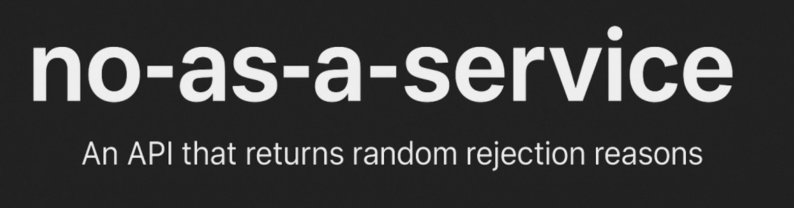

# No as a service (Go)



This tiny API returns random, generic, creative, and sometimes hilarious rejection reasons—perfectly suited for any scenario.

## 🚀 Usage

**Base URL**

```
https://localhost:8080/api/no
```

**Method**: GET

### 🔄 Example Request
```http
GET /api/no
```

### ✅ Example Response
```json
{
  "reason": "This feels like something Future Me would yell at Present Me for agreeing to."
}
```

Use it in apps, bots, landing pages, Slack integrations, rejection letters, or wherever you need a polite (or witty) no.

## 👤 Author

Taken shamelessly from [hotheadhacker](https://github.com/hotheadhacker) and re-implemented in Go.
